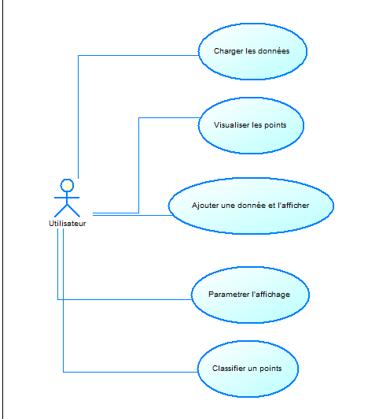
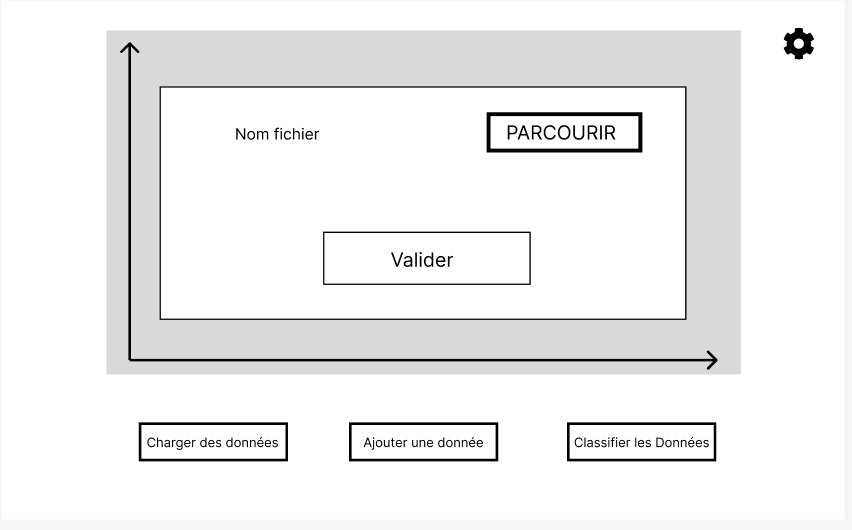
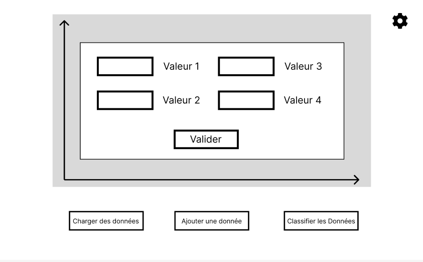
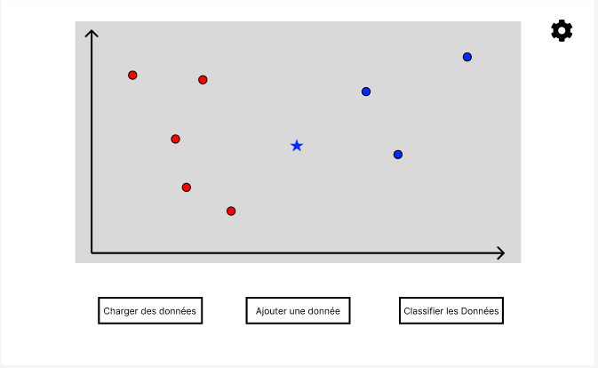
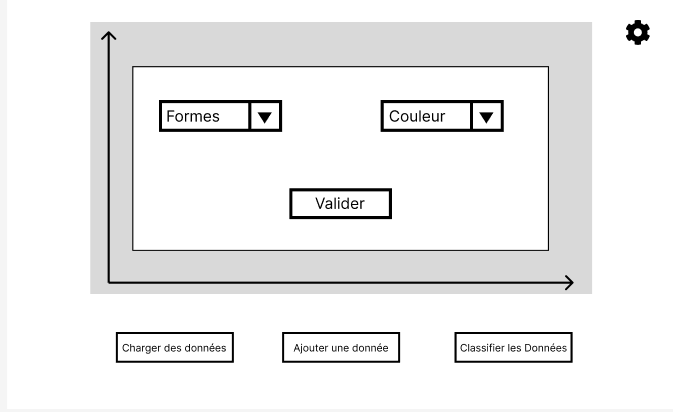
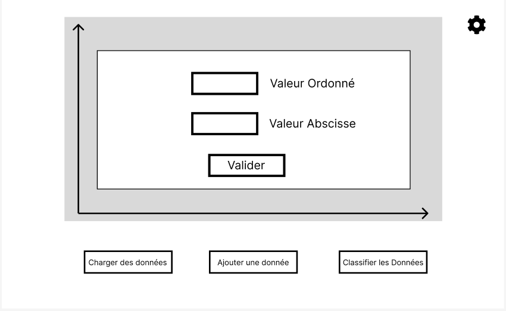
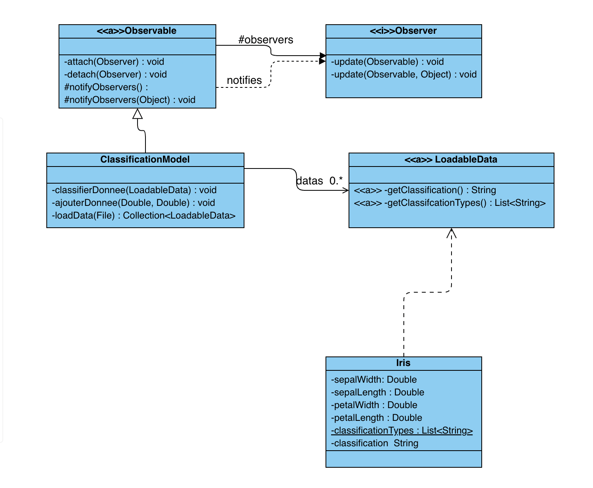

# SAE 3.01 - Logiciel de classification
## Partie Analyse

### Équipe H4

-  [ANTOINE Maxence](mailto:maxence.antoine.etu@univ-lille.fr)
-  [DEBUYSER Hugo](mailto:hugo.debuyser.etu@univ-lille.fr)
-  [DEKEISER Matisse](mailto:matisse.dekeiser.etu@univ-lille.fr)
-  [DESMONS Hugo](mailto:hugo.desmons.etu@univ-lille.fr)
-  [MENNECART Matias](mailto:matias.mennecart.etu@univ-lille.fr)

___

## Contribution des membres de l'équipe

#### ANTOINE Maxence :
Travail sur le diagramme de cas d'utilisations, a fait deux fiches descriptives avec Hugo DEBUYSER et Hugo DESMONS, a contribué au diagramme des classes, a complété le rapport de ce projet d'analyse et a participer à la conception de la maquette Figma.

#### DEBUYSER Hugo :
Travail sur le diagramme de cas d'utilisations, a fait deux fiches descriptives avec Hugo DESMONS et Maxence ANTOINE, a contribué au diagramme des classes, a commencé le rapport de ce projet d'analyse et a participer à la conception de la maquette Figma.

#### DEKEISER Matisse :
Travail sur le diagramme de cas d'utilisations, a fait une fiche descriptive avec Matias MENNECART, a contribué au diagramme des classes de ce projet d'analyse et a participer à la conception de la maquette Figma.

#### DESMONS Hugo :
Travail sur le diagramme de cas d'utilisations, a fait deux fiches descriptives avec Hugo DEBUYSER et Maxence ANTOINE, a contribué au diagramme des classes de ce projet d'analyse et a participer à la conception de la maquette Figma.

#### MENNECART Matias :
Travail sur le diagramme de cas d'utilisations, a fait une fiche descriptive avec Matisse DEKEISER, a finalisé le diagramme des classes de ce projet d'analyse et a participer à la conception de la maquette Figma.

___

## Diagramme de cas d'utilisation

Systeme: Application de classification de données

### Fiches descriptives

#### Fiche descriptive: Utilisation du logiciel, Charger l'ensemble des données

    Système: Logiciel de classification
    Cas d'utilisation: Charger l'ensemble des données
    
        Acteur Principal: Utilisateur
    
        Déclencheur:
    
        Acteur Secondaire:
    
        Précondition:
    
        Garantie en cas de succès: Les données sont affichées dans le graphe.
    
        Garantie minimale:
    
    Scénario nominal:
    
        1) L'utilisateur sélectionne le bouton de chargement de données.
        2) Le système ouvre l'explorateur de fichier.
        3) L'utilisateur choisi la base de données à charger.
        4) Le système vérifie à la conformité des données implémentées.
        5) L'utilisateur Sélectionne les axes pour l'affichage du graphe.
        6) Le système affiche les données.
    
    Scénario alternatif:
    A)  4) Le système vérifie les données implémentées et renvoie une erreur à l'utilisateur.

#### Fiche descriptive: Utilisation du logiciel, Ajouter une donnée

    Système: Logiciel de classification
    
    Cas d'utilisation: Ajouter une donnée
    
    Acteur Principal: Utilisateur
    
    Déclencheur:
    
    Acteur Secondaire:
    
    Précondition: Le système doit avoir chargé des données.
    
    Garantie en cas de succès: L'ajout d'une donnée.
    
    Garantie minimale:
    
    Scénario nominal:
    
        1) L'utilisateur ajoute un nouveau point en cliquant sur le bouton associé.
        2) Le système lui affiche un menu contextuel.
        3) L'utilisateur entre les valeurs et valide.
        4) Le système affiche le nouveau point avec un symbole et une couleur différent des autres points.
    
    Scénario alternatif:

#### Fiche descriptive: Utilisation du logiciel, Classifier une donnée non classifiée

    Système : Système de visualisation et classification. 

    Cas d'utilisation : Classifier la donnée non classifié.

    Acteur Principal : Utilisateur

    Déclencheur : 

    Autres acteurs :

    Pré-condition : Avoir ajouté une donnée.

    Garanties en cas de succès : La ou les donnée(s) ajoutées est/sont classifiée(s).

    Garanties minimales : La donnée n'est pas classifié et une erreur est affiché.

    Scénario nominal :

        1) L'utilisateur actionne le bouton "classifier les données".
        2) Le système classifie les points de façon aléatoire et modifie leurs couleurs en fonction de la classe choisis.

### Prototypes pour l'interface

Vous pouvez retrouver le [Prototype figma](https://www.figma.com/design/J7CNIyIPHg0QBvoMKEAZ2L/Untitled?node-id=0-1&t=rzTi4oB0jeOOZTxv-1) afin de tester une démonstration de la maquette de l'application.

#### Interface principale

La première page de l’interface se compose des éléments suivants :

- **Nuage de points** : Pour l'instant vide, permettra d'afficher le nuage de points..

- **Icône d'engrenage** :Située en haut à droite de la zone d’affichage permet d'accéder à un menu de paramètres pour configurer l'affichage.

- **Bouton charger des données** : Ce bouton ouvre une fenêtre qui permet à l’utilisateur d'importer un fichier contenant les données avec lesquelles il souhaite travailler.
- **Bouton ajouter une donnée** : Cette option permet à l’utilisateur d’ajouter une donnée au nuage de point.
- **Bouton classifier les données** : Ce bouton permet la classification des données non classifiées grâce a un algorithme (Pour le jalon 1, cette classification est aléatoire).

---

#### Fenêtre de chargement de fichier

- **Bouton "PARCOURIR"** : Ce bouton permet à l’utilisateur d'ouvrir une fenêtre de navigation dans ses fichiers locaux afin de sélectionner le fichier de données à importer dans l’application.
- **Nom fichier** : une zone texte où s’affichera le chemin vers le fichier sélectionné après avoir utilisé le bouton "PARCOURIR".
- **Bouton "Valider"** : Une fois le fichier sélectionné, ce bouton permet de confirmer le choix et de lancer le chargement du fichier dans le nuage de points.

---

#### Ajouter une donnée

Cette page présente une interface permettant à l’utilisateur d'ajouter manuellement de nouvelles données pour lesquelles il souhaite déterminer une classification.

- **Champs de saisie pour les valeurs** : Quatre champs de texte sont affichés permettant d'inscrire les 4 valeurs necessaires pour ajouter une donnée (Uniquement des Iris pour le jalon 1).
- **Bouton "Valider"** : Après avoir rempli les champs de saisie, l’utilisateur peut cliquer sur ce bouton pour valider l'entrée. Cela ajoutera la donnée dans le nuage de points.
- **Ajout d'une donnée** : On remarque qu'après avoir cliqué sur le bouton "Valider", une valeur a été ajouté sous une forme et une couleur diférenciées des autres.
---

#### Visualisation des données classifiées

Cette page représente la visualisation graphique des données après l’étape de classification (réalisé par l'action sur le bouton `classifier les données`, ainsi tous les points non classifiés le sont).

- **Bouton "Classifier les données"** : En appuyant sur ce bouton, la donnée ajoutée se classifie selon ses valeurs renseignés.

La donnée qui avait été ajoutée par l'utilisateur garde un symbole différenciateur mais adopte la couleur de la classification qui lui a été déterminer.

---

#### Modification des attributs d'affichage

Cette page permet à l’utilisateur de modifier les attributs utilisés pour représenter les données sur le graphique, en particulier les valeurs des axes X (abscisses) et Y (ordonnées).

- **Champ "Valeur Ordonnée"** : L'utilisateur peut selectioner ici la valeur qu'il souhaite voir représentée sur l'axe des ordonnées (Y) du graphique.
- **Champ "Valeur Abscisse"** : L'utilisateur peut selectioner ici la valeur qu'il souhaite voir représentée sur l'axe des abscisses (X) du graphique.
- **Bouton "Valider"** : Une fois les valeurs des axes définies, l’utilisateur peut cliquer sur ce bouton pour appliquer ces paramètres et afficher les données selon les nouveaux attributs choisis.

---

## Diagramme de classes

Nous avons fais le choix d'implémenter la classe `ClassificationModel`comme un singleton afin d'éviter que plusieurs model se retrouve au sein de la même application et créé des incohérences.