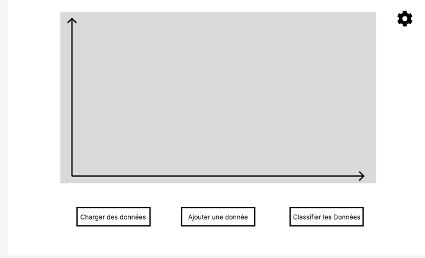

# SAE 3.01 - Logiciel de classification
## Partie Analyse

### Équipe H4

-  [ANTOINE Maxence](maxence.antoine.etu@univ-lille.fr)
-  [DEBUYSER Hugo](hugo.debuyser.etu@univ-lille.fr)
-  [DEKEISER Matisse](matisse.dekeiser.etu@univ-lille.fr)
-  [DESMONS Hugo](hugo.desmons.etu@univ-lille.fr)
-  [MENNECART Matias](matias.mennecart.etu@univ-lille.fr)

___

## Contribution des membres de l'équipe

#### ANTOINE Maxence :
Travail sur le diagramme de cas d'utilisations, a fait deux fiches descriptives avec Hugo DEBUYSER et Hugo DESMONS, a contribué au diagramme des classes, a complété le rapport de ce projet d'analyse et a participer à la conception de la maquette Figma.

#### DEBUYSER Hugo :
Travail sur le diagramme de cas d'utilisations, a fait deux fiches descriptives avec Hugo DESMONS et Maxence ANTOINE, a contribué au diagramme des classes, a commencé le rapport de ce projet d'analyse et a participer à la conception de la maquette Figma.

#### DEKEISER Matisse :
Travail sur le diagramme de cas d'utilisations, a fait une fiche descriptive avec Matias MENNECART, a contribué au diagramme des classes de ce projet d'analyse et a participer à la conception de la maquette Figma.

#### DESMONS Hugo :
Travail sur le diagramme de cas d'utilisations, a fait deux fiches descriptives avec Hugo DEBUYSER et Maxence ANTOINE, a contribué au diagramme des classes de ce projet d'analyse et a participer à la conception de la maquette Figma.

#### MENNECART Matias :
Travail sur le diagramme de cas d'utilisations, a fait une fiche descriptive avec Matisse DEKEISER, a finalisé le diagramme des classes de ce projet d'analyse et a participer à la conception de la maquette Figma.

___

## Diagramme de cas d'utilisation

### Fiches descriptives

#### Fiche descriptive: Utilisation du logiciel, Charger l'ensemble des données
    
    Système: Logiciel de classification
    Cas d'utilisation: Charger l'ensemble des données
    
        Acteur Principal: Utilisateur
    
        Déclencheur:
    
        Acteur Secondaire:
    
        Précondition:
    
        Garantie en cas de succès: Les données sont affichées dans le graphe.
    
        Garantie minimale:
    
    Scénario nominal:
    
        1) L'utilisateur sélectionne le bouton de chargement de données.
        2) Le système ouvre l'explorateur de fichier.
        3) L'utilisateur choisi la base de données à charger.
        4) Le système vérifie à la conformité des données implémentées.
        5) L'utilisateur Sélectionne les axes pour l'affichage du graphe.
        6) Le système affiche les données.
    
    Scénario alternatif:
    A)  4) Le système vérifie les données implémentées et renvoie une erreur à l'utilisateur.

#### Fiche descriptive: Utilisation du logiciel, Ajouter une donnée
    
    Système: Logiciel de classification
    
    Cas d'utilisation: Ajouter une donnée
    
    Acteur Principal: Utilisateur
    
    Déclencheur:
    
    Acteur Secondaire:
    
    Précondition: Le système doit avoir chargé des données.
    
    Garantie en cas de succès: L'ajout d'une donnée.
    
    Garantie minimale:
    
    Scénario nominal:
    
        1) L'utilisateur ajoute un nouveau point en cliquant sur le bouton associé.
        2) Le système lui affiche un menu contextuel.
        3) L'utilisateur entre les valeurs et valide.
        4) Le système affiche le nouveau point avec un symbole et une couleur différent des autres points.
    
    Scénario alternatif:

#### Fiche descriptive: Utilisation du logiciel, Classifier une donnée non classifiée

    Système : Système de visualisation et classification. 

    Cas d'utilisation : Classifier la donnée non classifié.

    Acteur Principal : Utilisateur

    Déclencheur : 

    Autres acteurs :

    Pré-condition : Avoir ajouté une donnée.

    Garanties en cas de succès : La ou les donnée(s) ajoutées est/sont classifiée(s).

    Garanties minimales : La donnée n'est pas classifié et une erreur est affiché.

    Scénario nominal :

        1) L'utilisateur actionne le bouton "classifier les données".
        2) Le système classifie les points de façon aléatoire et modifie leurs couleurs en fonction de la classe choisis.

*Inclure les fiches descriptives pour ces fonctionnalités:*

- *Charger l'ensemble de données*
- *Ajouter une donnée*
- *Classifier la donnée non classifiée*

### Prototypes pour l'interface

[Prototype figma](https://www.figma.com/design/J7CNIyIPHg0QBvoMKEAZ2L/Untitled?node-id=0-1&t=rzTi4oB0jeOOZTxv-1)

*Inclure des prototypes de l'interface utilisateur pour ces fonctionnalités:*

- *Ajouter une donnée*

- *Classifier la donnée non classifiée*

- *Modifier les attributs pour l'affichage*

*Chaque prototype est constitué d'une suite d'écrans, ou d'une arborescence d'écrans si plusieurs chemins d'interaction sont possibles.*

*Pour les deux fonctionnalités dont on demande le prototype et la fiche descriptive, vous ferez le lien entre le prototype et la fiche descriptive. Plus précisément, pour chaque étape de la fiche descriptive, vous indiquerez à quel écran elle correspond. Vous pouvez par exemple mettre une légende sous l'écran, par ex. "Écran pour l'étape 3 de la fiche descriptive du UC Ajouter une donnée."*

*Les prototypes peuvent être en faible fidélité.*

*Les prototypes peuvent être dessinés à la main ou générés en utilisant un logiciel. Dans les deux cas, veillez à ce que les images soient lisibles et avec une bonne résolution (possibilité de zoomer pour lire le texte qui s'y trouve).*

## Diagramme de classes

*Inclure un diagramme de classes qui permet d'**implémenter toutes les fonctionnalités**.*

*Le diagramme de classes doit suivre le design pattern MVC, mais vous ne ferez pas figurer les classes de la vue. Il doit être clair quelles classes font partie du contrôleur (par exemple grâce à un nom de classe qui contient 'Controleur'); les classes restantes seront considérées faisant partie du modèle.*

*L'image du diagramme doit être de résolution suffisante permettant de zoomer et lire le texte qui y figure.*

