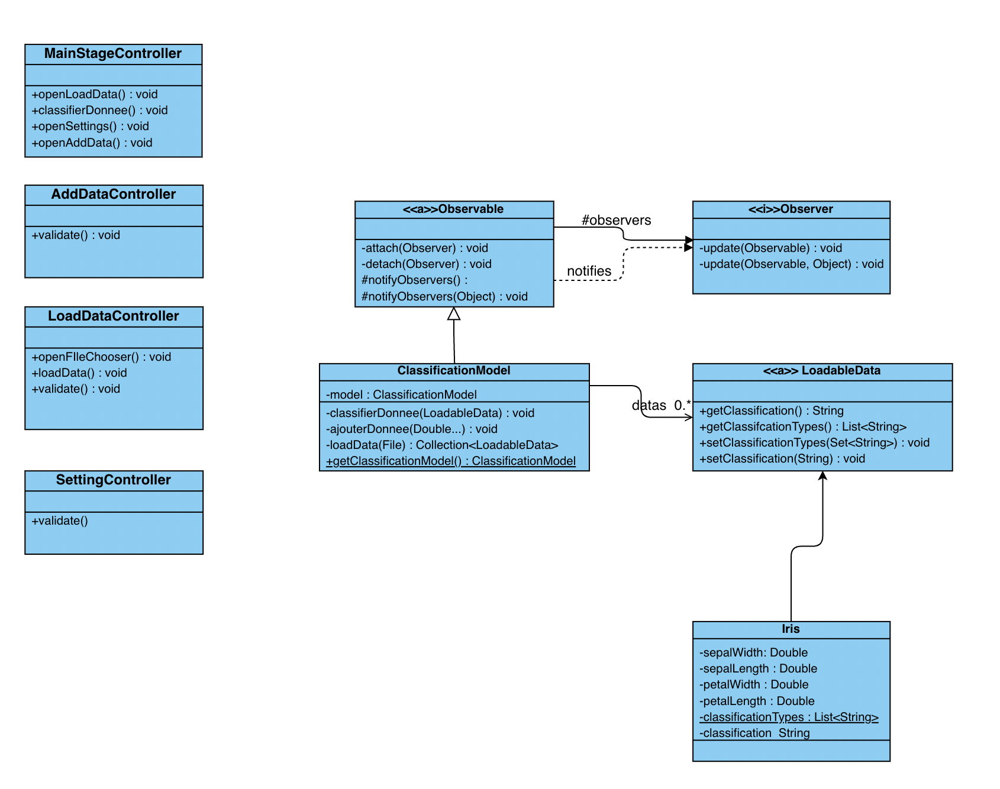

# SAE 3.01 - Logiciel de classification
## Partie Analyse

### Équipe H4

-  [ANTOINE Maxence](maxence.antoine.etu@univ-lille.fr)
-  [DEBUYSER Hugo](hugo.debuyser.etu@univ-lille.fr)
-  [DEKEISER Matisse](matisse.dekeiser.etu@univ-lille.fr)
-  [DESMONS Hugo](hugo.desmons.etu@univ-lille.fr)
-  [MENNECART Matias](matias.mennecart.etu@univ-lille.fr)

___

## Contribution des membres de l'équipe

#### ANTOINE Maxence :
Travail sur le diagramme de cas d'utilisations, a fait deux fiches descriptives avec Hugo DEBUYSER et Hugo DESMONS, a contribué au diagramme des classes, a complété le rapport de ce projet d'analyse et a participer à la conception de la maquette Figma.

#### DEBUYSER Hugo :
Travail sur le diagramme de cas d'utilisations, a fait deux fiches descriptives avec Hugo DESMONS et Maxence ANTOINE, a contribué au diagramme des classes, a commencé le rapport de ce projet d'analyse et a participer à la conception de la maquette Figma.

#### DEKEISER Matisse :
Travail sur le diagramme de cas d'utilisations, a fait une fiche descriptive avec Matias MENNECART, a contribué au diagramme des classes de ce projet d'analyse et a participer à la conception de la maquette Figma.

#### DESMONS Hugo :
Travail sur le diagramme de cas d'utilisations, a fait deux fiches descriptives avec Hugo DEBUYSER et Maxence ANTOINE, a contribué au diagramme des classes de ce projet d'analyse et a participer à la conception de la maquette Figma.

#### MENNECART Matias :
Travail sur le diagramme de cas d'utilisations, a fait une fiche descriptive avec Matisse DEKEISER, a finalisé le diagramme des classes de ce projet d'analyse et a participer à la conception de la maquette Figma.

___

## Diagramme de cas d'utilisation

### Fiches descriptives

#### Fiche descriptive: Utilisation du logiciel, Charger l'ensemble des données
    
    Système: Logiciel de classification
    Cas d'utilisation: Charger l'ensemble des données
    
        Acteur Principal: Utilisateur
    
        Déclencheur:
    
        Acteur Secondaire:
    
        Précondition:
    
        Garantie en cas de succès: Les données sont affichées dans le graphe.
    
        Garantie minimale:
    
    Scénario nominal:
    
        1) L'utilisateur sélectionne le bouton de chargement de données.
        2) Le système ouvre l'explorateur de fichier.
        3) L'utilisateur choisi la base de données à charger.
        4) Le système vérifie à la conformité des données implémentées.
        5) L'utilisateur Sélectionne les axes pour l'affichage du graphe.
        6) Le système affiche les données.
    
    Scénario alternatif:
    A)  4) Le système vérifie les données implémentées et renvoie une erreur à l'utilisateur.

#### Fiche descriptive: Utilisation du logiciel, Ajouter une donnée
    
    Système: Logiciel de classification
    
    Cas d'utilisation: Ajouter une donnée
    
    Acteur Principal: Utilisateur
    
    Déclencheur:
    
    Acteur Secondaire:
    
    Précondition: Le système doit avoir chargé des données.
    
    Garantie en cas de succès: L'ajout d'une donnée.
    
    Garantie minimale:
    
    Scénario nominal:
    
        1) L'utilisateur ajoute un nouveau point en cliquant sur le bouton associé.
        2) Le système lui affiche un menu contextuel.
        3) L'utilisateur entre les valeurs et valide.
        4) Le système affiche le nouveau point avec un symbole et une couleur différent des autres points.
    
    Scénario alternatif:

#### Fiche descriptive: Utilisation du logiciel, Classifier une donnée non classifiée

    Système : Système de visualisation et classification. 

    Cas d'utilisation : Classifier la donnée non classifié.

    Acteur Principal : Utilisateur

    Déclencheur : 

    Autres acteurs :

    Pré-condition : Avoir ajouté une donnée.

    Garanties en cas de succès : La ou les donnée(s) ajoutées est/sont classifiée(s).

    Garanties minimales : La donnée n'est pas classifié et une erreur est affiché.

    Scénario nominal :

        1) L'utilisateur actionne le bouton "classifier les données".
        2) Le système classifie les points de façon aléatoire et modifie leurs couleurs en fonction de la classe choisis.

*Inclure les fiches descriptives pour ces fonctionnalités:*

- *Charger l'ensemble de données*
- *Ajouter une donnée*
- *Classifier la donnée non classifiée*

### Prototypes pour l'interface

[Prototype figma](https://www.figma.com/design/J7CNIyIPHg0QBvoMKEAZ2L/Untitled?node-id=0-1&t=rzTi4oB0jeOOZTxv-1)

#### Interface principale

La première page de l’interface se compose des éléments suivants :

- **Zone principale d’affichage (grisée)** :  
  Une grande zone située dans la partie supérieure de l’écran, encadrée par deux axes — un axe vertical (ordonnées) et un axe horizontal (abscisses). Elle est probablement destinée à afficher des graphiques, des tableaux ou des visualisations de données une fois celles-ci chargées et traitées. Le placement des axes suggère que des représentations visuelles (par exemple, des diagrammes ou des courbes) seront présentées dans cet espace après l'exécution des différentes opérations.

- **Icône d'engrenage (paramètres)** :  
  Située en haut à droite de la zone d’affichage, cette icône en forme de roue dentée permet d'accéder à un menu de paramètres ou d’options de configuration pour l’application.

- **Boutons d'action** :  
  Trois boutons sont situés en bas de la page, permettant l’interaction avec l’application :
    - **Charger des données** : Ce bouton permet à l’utilisateur d'importer un fichier contenant des données dans l'application. Cette fonction pourrait ouvrir une fenêtre pour sélectionner et charger un fichier depuis le système local.
    - **Ajouter une donnée** : Cette option permet à l’utilisateur d’ajouter des données spécifiques, soit manuellement, soit à partir d'une autre source.
    - **Classifier les données** : Ce bouton semble être destiné à déclencher une fonction de classification des données, possiblement à l’aide d’un algorithme d’apprentissage automatique ou d’un autre modèle statistique.

---

*Inclure des prototypes de l'interface utilisateur pour ces fonctionnalités:*

#### Fenêtre de chargement de fichier

La deuxième page correspond à une étape spécifique dans le flux de travail, orientée vers la sélection et l’importation de fichiers. Elle se compose des éléments suivants :

- **Zone centrale (grisée)** :  
  Cette zone est structurée pour faciliter le choix de fichier par l’utilisateur.
  - **Nom fichier** : Une étiquette ou une zone texte où s’affichera le nom du fichier sélectionné après avoir utilisé le bouton de navigation.
  - **Bouton "PARCOURIR"** : Ce bouton permet à l’utilisateur d'ouvrir une fenêtre de navigation dans ses fichiers locaux afin de sélectionner le fichier de données à importer dans l’application.
  - **Bouton "Valider"** : Une fois le fichier sélectionné, ce bouton permet de confirmer le choix et de lancer le chargement du fichier pour traitement.

---

- *Ajouter une donnée*

#### Formulaire d'ajout de données

Cette page présente une interface permettant à l’utilisateur d'ajouter manuellement de nouvelles données dans l’application. Les éléments principaux sont :

- **Zone centrale (grisée)** :
  - **Champs de saisie pour les valeurs** : Quatre champs de texte sont affichés dans une boîte. Ils sont étiquetés comme suit :
    - Valeur 1
    - Valeur 2
    - Valeur 3
    - Valeur 4  
      Ces champs permettent à l’utilisateur de saisir manuellement quatre valeurs différentes.
  - **Bouton "Valider"** : Après avoir rempli les champs de saisie, l’utilisateur peut cliquer sur ce bouton pour valider l’entrée des données. Cela enregistrera la nouvelle donnée et l’ajoutera à l’ensemble de données existant.

---

#### Visualisation des données classifiées

Cette page représente la visualisation graphique des données après l’étape de classification. Les éléments affichés sont :

- **Zone centrale (grisée)** :
  - **Graphique de dispersion** : La zone est désormais utilisée pour afficher un diagramme de dispersion. On y voit plusieurs points de deux couleurs différentes, probablement représentatifs de deux classes distinctes de données :
    - **Points rouges** : Ces points représentent une première catégorie de données classifiées.
    - **Points bleus** : Ils représentent une deuxième catégorie de données classifiées.
    - **Étoile bleue** : Ce symbole représente la nouvelle donnée que l’utilisateur a ajoutée manuellement. L’étoile montre la position de cette donnée sur le graphique, suggérant qu'elle a été classée dans la même catégorie que les points bleus.

---

- *Classifier la donnée non classifiée*

#### Classification d'une donnée non classifiée

Cette page permet à l'utilisateur de classifier une donnée qui n'a pas encore été attribuée à une catégorie spécifique. Voici les éléments de cette page :

- **Zone centrale (grisée)** :
  - **Liste déroulante "Formes"** : Cette liste permet à l'utilisateur de choisir une forme spécifique pour représenter la donnée (par exemple, cercle, carré, étoile, etc.). Ce choix semble influer sur la manière dont la donnée sera affichée graphiquement.
  - **Liste déroulante "Couleur"** : De manière similaire, cette liste déroulante permet à l'utilisateur de sélectionner la couleur de la donnée non classifiée. Ce choix permettra probablement d'assigner une catégorie visuelle spécifique (comme un groupe de points ou une classe dans un diagramme).
  - **Bouton "Valider"** : Une fois les deux attributs sélectionnés (forme et couleur), ce bouton permet de confirmer et d'enregistrer la classification de la donnée. Elle sera ensuite traitée avec ces caractéristiques visuelles lors de son affichage.

---

- *Modifier les attributs pour l'affichage*

#### Modification des attributs d'affichage

Cette page permet à l’utilisateur de modifier les attributs utilisés pour représenter les données sur le graphique, en particulier les valeurs des axes X (abscisses) et Y (ordonnées).

- **Zone centrale (grisée)** :
  - **Champ "Valeur Ordonnée"** : L'utilisateur peut saisir ici la valeur qu'il souhaite voir représentée sur l'axe des ordonnées (Y) du graphique. Cela pourrait être une variable ou une métrique spécifique à la donnée.
  - **Champ "Valeur Abscisse"** : Ce champ permet de spécifier la valeur qui sera affichée sur l'axe des abscisses (X) du graphique. Cela permet de définir quelle dimension ou quelle caractéristique de la donnée sera tracée le long de cet axe.
  - **Bouton "Valider"** : Une fois les valeurs des axes définies, l’utilisateur peut cliquer sur ce bouton pour appliquer ces paramètres et afficher les données selon les nouveaux attributs choisis.

---

*Chaque prototype est constitué d'une suite d'écrans, ou d'une arborescence d'écrans si plusieurs chemins d'interaction sont possibles.*

*Pour les deux fonctionnalités dont on demande le prototype et la fiche descriptive, vous ferez le lien entre le prototype et la fiche descriptive. Plus précisément, pour chaque étape de la fiche descriptive, vous indiquerez à quel écran elle correspond. Vous pouvez par exemple mettre une légende sous l'écran, par ex. "Écran pour l'étape 3 de la fiche descriptive du UC Ajouter une donnée."*

*Les prototypes peuvent être en faible fidélité.*

*Les prototypes peuvent être dessinés à la main ou générés en utilisant un logiciel. Dans les deux cas, veillez à ce que les images soient lisibles et avec une bonne résolution (possibilité de zoomer pour lire le texte qui s'y trouve).*

## Diagramme de classes

*Inclure un diagramme de classes qui permet d'**implémenter toutes les fonctionnalités**.*

*Le diagramme de classes doit suivre le design pattern MVC, mais vous ne ferez pas figurer les classes de la vue. Il doit être clair quelles classes font partie du contrôleur (par exemple grâce à un nom de classe qui contient 'Controleur'); les classes restantes seront considérées faisant partie du modèle.*

*L'image du diagramme doit être de résolution suffisante permettant de zoomer et lire le texte qui y figure.*

